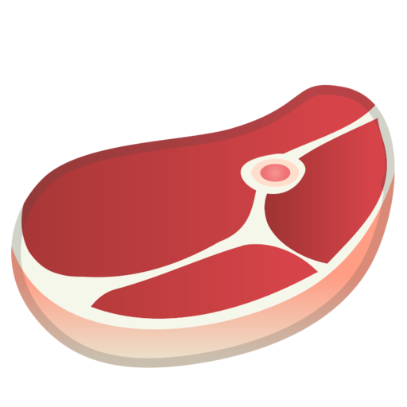
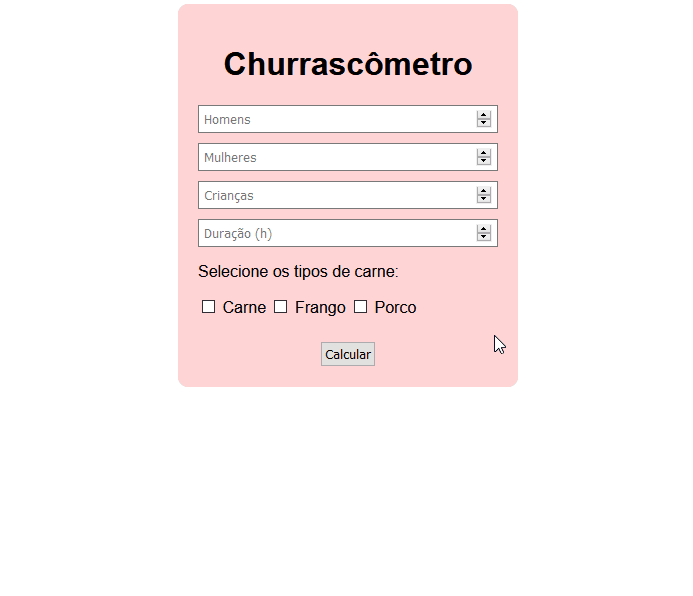

<h1 align="center">
 
  
 
 
Churrascômetro
</h1>

This project calculates the amount of meat, beer and bottles of soda / water you would need for a barbecue.

  

[//]: # (Add your gifs/images here:)

  

## Getting started

Just clone the repository and open index.html in a browser ;D

## License

This project is licensed under the MIT License - see the [LICENSE](https://opensource.org/licenses/MIT) page for details.